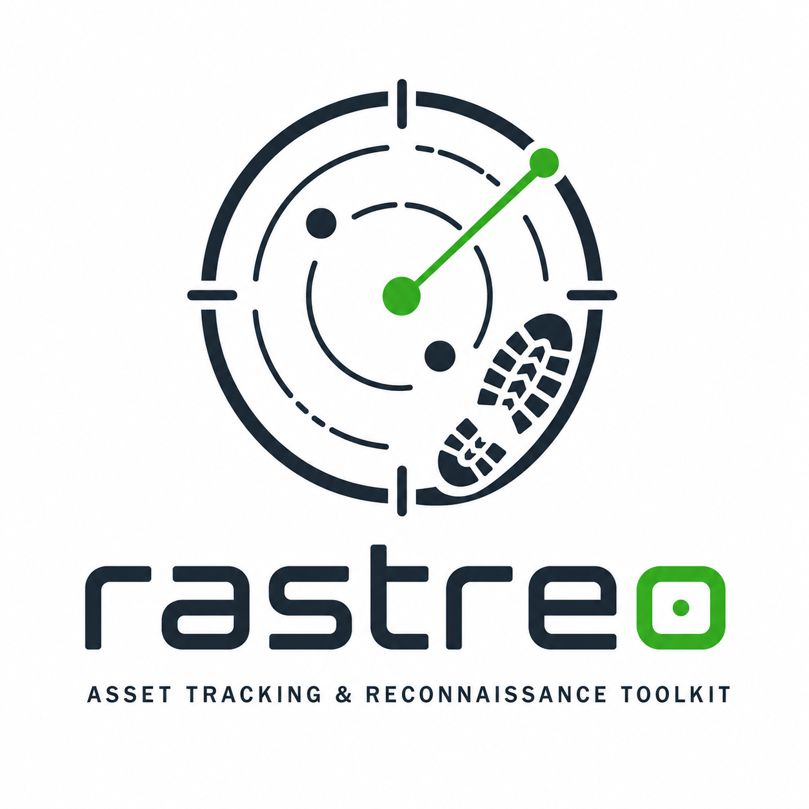

  

## Summary

<!-- Brief description of what this PR does and why. -->

## Changes

<!-- List the specific changes made. -->

-

## Test plan

<!-- How was this tested? Include commands run, scenarios validated, etc. -->

-

## Checklist

- [ ] `cargo test --workspace` passes
- [ ] `cargo clippy --workspace -- -D warnings` is clean
- [ ] `cargo fmt --all -- --check` is clean
- [ ] Documentation in docs/site/docs/ updated (if applicable)
- [ ] No agent attribution (Opus / Sonnet / @reviewer / @implementer) in commit messages, PR title, or PR body
