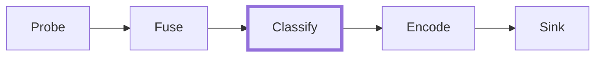

# Classification

Classification is the pipeline stage that assigns canonical `platform`, `os_version`, `ssh_version`, `http_server`, `http_version`, and `role` values on each `DeviceRecord`. It runs after fusion (per-IP records plus identity correlation) and before encoding, so the classifier sees the fully merged record — every signal from every prober against every IP that folded into the device.

`platform` is a fielded identifier for the OS the device runs — `cisco_ios`, `linux`, `freebsd`, `junos`. `os_version` carries the OS version paired with `platform`, for example `15.7` (IOS release) or `Ubuntu` (Linux distro token from an SSH banner). `ssh_version` carries the SSH software identifier from an `SshBanner` — for example `OpenSSH_8.9p1`. `http_server` and `http_version` carry the web-server product and version captured from an `HttpBanner` — for example `nginx` + `1.24.0`. `role` is a fielded category like `router`, `switch`, `web_server`, or `host`.

All six fields exist so downstream reconcilers (NetBox, Nautobot, Infrahub) receive already-canonicalised values instead of inferring them from raw signals. Keeping the web-server product on its own field (`http_server`) preserves `platform` for the OS — nginx runs on Linux, BSD, and Windows, so putting `nginx` in `platform` would be a category error against source-of-truth OS-platform models.

Two classifier variants ship: `rules` (the default — regex-driven platform detection plus signal-driven role detection, each backed by a table that ships with rastreo) and `noop` (pass-through). The `rules` classifier populates `platform`, `os_version`, `ssh_version`, `http_server`, and `http_version` in its platform phase, then `role` in its role phase.

!!! info "Each field is written only from evidence about the thing it names"
    `platform` and `os_version` name the device's operating system, so they are written only from a signal that identifies the device — an SNMP `sysDescr`, not a service banner. `ssh_version`, `http_server`, and `http_version` name software listening on a port, so they are written from that port's banner regardless of what identified the platform.

    A Nokia SR Linux switch answers SSH with `SSH-2.0-OpenSSH_10.0p2 Debian-7+deb13u2`. That banner is a fact about the sshd binary, not about the switch: it yields `ssh_version: OpenSSH_10.0p2` and nothing else, while `platform: nokia_srlinux` and `os_version: 26.3.3` come from the device's `sysDescr`. Scan the same switch with only the SSH prober and `platform` stays `null` — a `null` never overwrites the curated platform in your source of truth, and `linux` would. If you scan a server estate where a service banner really does identify the machine, opt into the [banner heuristics](#banner-heuristics-opt-in).

## Available classifiers

| Classifier | Behaviour |
|---|---|
| `rules` | Runs a platform phase (regex patterns against a named signal kind) then a role phase (`sysObjectID` subtree containment, regex against a named signal kind, and `OpenPort` set-membership matching). First match per phase wins. Selected when the scenario does not configure a classifier, running the baked-in tables on their own. |
| `noop` | Leaves every `DeviceRecord` unchanged. `platform`, `os_version`, `ssh_version`, `http_server`, `http_version`, and `role` stay `null`. Select it explicitly to get raw signals with no canonical fields derived from them. |

## Pipeline position



The classifier is the fourth stage. Each stage has one job:

- **probe** — runs each configured prober and produces raw probe outcomes per target.
- **fuse** — groups outcomes into `DeviceRecord` objects and correlates records that describe the same physical device.
- **classify** — assigns `platform`, `os_version`, `ssh_version`, `http_server`, `http_version`, and `role` on each merged record.
- **encode** — serialises the record for output.
- **sink** — delivers the encoded record to Kafka, NATS, a file, stdout, or memory.

Because the classifier runs after fusion, it operates on merged records. A device with three interfaces classifies once, not three times.

## Configuration

The classifier is configured under the top-level `classifier` key of a scenario. Omitting the key is equivalent to writing this — the `rules` classifier over the baked-in tables:

```yaml
classifier:
  type: rules
```

To turn classification off and get raw signals only, ask for `noop` explicitly:

```yaml
classifier:
  type: noop
```

The `type` field is required whenever the key is present. Each variant adds its own configuration fields.

Classification is configurable only from a scenario file. A flag-driven `rastreo discover --target ...` has no `--classifier` flag, so a flag-mode scan always runs the default `rules` classifier; put the scenario in a YAML file and run `rastreo discover --file scan.yaml` when you need `noop` or your own rules.

## Rules classifier

The `rules` classifier walks each `DeviceRecord`'s signals in two phases. The platform phase evaluates an ordered list of regex rules, filling each of `platform` (with its paired `os_version`), `ssh_version`, and `http_server` (with its paired `http_version`) from the first rule that both matches and claims that slot. The role phase then evaluates an ordered list of role rules and, on first match, sets `role`. Both phases preserve prepopulated values on the record.

The fields fill independently, so a rule winning `platform` does not stop a later rule from contributing `ssh_version`. A Cisco IOS device whose `sysDescr` sets `platform: cisco_ios` still reports the `ssh_version` its SSH banner carries.

Because it is the default, every scan populates `platform` and `role` on records reaching your downstream (NetBox, Nautobot, Infrahub) wherever the signals support it. That makes the default tables a write path into your source of truth, so they follow one principle: **a device gets a platform or a role when rastreo has evidence about the device, and stays `null` when rastreo only has a guess.** A `null` never overwrites anything downstream; a guess does. The default platform table claims a platform only from an SNMP `sysDescr`, which names the vendor and version of the device itself. The default role table is multi-port only: `[22, 179]` (SSH + BGP) says router in a way a lone open port never can. The banner and single-port heuristics ship too, but you opt into them — see [Banner heuristics](#banner-heuristics-opt-in) and [Port heuristics](#port-heuristics-opt-in).

Add your own rules for anything the defaults do not cover — in particular, `sys_object_id_prefix` role rules against your own devices' `sysObjectID` values (rastreo ships no baked defaults for OID prefixes; see [Baked-in role rules](#baked-in-role-rules) for why).

Rules are validated when the classifier is built, not at match time: a regex that fails to compile, a `ports_open` rule with an empty `ports` list, and a `sys_object_id_prefix` whose prefix is not a dotted-decimal OID are all rejected before the scan starts.

### Signal kinds

Platform rules and `signal_match` role rules address signals through the same vocabulary. Whichever rule kind you are writing, `signal` takes one of these values:

| `signal` | Emitted by | What it is good for |
|---|---|---|
| `snmp_sys_descr` | `snmp` | Platform and OS version. The richest banner most network devices publish. |
| `snmp_sys_object_id` | `snmp` | Vendor, model, and role. The enterprise arc — `6527` in `1.3.6.1.4.1.6527.1.20.26` — names the vendor unambiguously, which makes it the strongest evidence SNMP hands you. |
| `snmp_sys_name` | `snmp` | Role, if your fleet follows a hostname convention such as `dc1-spine01`. Weak platform evidence: a hostname is whatever the operator typed. |
| `ssh_banner` | `ssh` | Platform, OS version, and SSH software. |
| `http_banner` | `http` | Web-server product and version. Weak platform evidence: nginx and Apache run on every OS. |

A rule naming a signal kind the record does not carry simply does not match — no error, no partial classification. That means you can write rules against `snmp_sys_object_id` and keep them in a scenario you also run without the SNMP prober.

## Baked-in platform rules

The baked-in rules are evaluated in the order shown below. SNMP `sysDescr` rules run first (most specific), followed by SSH banner rules, then HTTP banner rules. Only the `sysDescr` rules claim a `platform`; the banner rules contribute the software fields for the port they read.

| # | Signal | Pattern | `platform` | `os_version` | `ssh_version` | `http_server` | `http_version` |
|---|---|---|---|---|---|---|---|
| 1 | `snmp_sys_descr` | `^Cisco IOS Software.*Version (?P<version>[\d\.]+)` | `cisco_ios` | `version` | — | — | — |
| 2 | `snmp_sys_descr` | `^Cisco IOS XR.*Version (?P<version>[\d\.]+)` | `cisco_ios_xr` | `version` | — | — | — |
| 3 | `snmp_sys_descr` | `^Cisco NX-OS.*Version (?P<version>[\d\.]+)` | `cisco_nxos` | `version` | — | — | — |
| 4 | `snmp_sys_descr` | `^Juniper Networks, Inc\..*JUNOS (?P<version>[\d\.]+)` | `junos` | `version` | — | — | — |
| 5 | `snmp_sys_descr` | `^Arista Networks EOS version (?P<version>[\d\.]+)` | `arista_eos` | `version` (numeric prefix; the `M`/`F` maintenance/feature suffix is not captured) | — | — | — |
| 6 | `snmp_sys_descr` | `^SRLinux-v(?P<version>[\d\.]+)` | `nokia_srlinux` | `version` → `26.3.3` (the build suffix after the version, `-392-g480f5fa2d04`, is not captured) | — | — | — |
| 7 | `snmp_sys_descr` | `^Linux\s+\S+\s+(?P<version>[\d\.]+)-` | `linux` | `version` (kernel release, e.g. `5.15.0`, not the distro name like `Ubuntu 22.04`) | — | — | — |
| 8 | `ssh_banner` | `^SSH-2\.0-(?P<sshv>OpenSSH_[\d\.p]+)\s+(?P<osv>Ubuntu)` | — | — | `sshv` → `OpenSSH_9.6p1` | — | — |
| 9 | `ssh_banner` | `^SSH-2\.0-(?P<sshv>OpenSSH_[\d\.p]+)\s+(?P<osv>Debian)` | — | — | `sshv` → `OpenSSH_9.2p1` | — | — |
| 10 | `ssh_banner` | `^SSH-2\.0-(?P<sshv>OpenSSH_[\d\.p]+)\s+(?P<osv>FreeBSD)` | — | — | `sshv` → `OpenSSH_9.5` | — | — |
| 11 | `http_banner` | `^(?P<server>nginx)/(?P<version>[\d\.]+)` | — | — | — | `server` → `nginx` | `version` → `1.24.0` |
| 12 | `http_banner` | `^(?P<server>Apache)/(?P<version>[\d\.]+)` | — | — | — | `server` → `Apache` | `version` → `2.4.58` |

!!! warning "Match `sysObjectID` by subtree, not by regex"
    Rules 1–7 key on `sysDescr` rather than `sysObjectID` for two reasons: `sysDescr` carries the OS version that populates `os_version`, and a platform rule can only reach `sysObjectID` through a regex. A regex has no notion of an OID arc boundary — `^1\.3\.6\.1\.4\.1\.6527` matches `1.3.6.1.4.1.65271`, a different vendor's tree. If you write a platform rule against `snmp_sys_object_id`, anchor the pattern at an arc boundary with a trailing `\.` or `$`: `^1\.3\.6\.1\.4\.1\.6527\.` or `^1\.3\.6\.1\.4\.1\.6527$`. Role rules have `sys_object_id_prefix`, which compares whole arcs and needs no such care — prefer it when you are classifying by OID.

### Banner heuristics (opt-in)

An SSH or HTTP banner names the software answering on a port. On a general-purpose server that software usually does imply the OS; on a network appliance it does not. A Nokia SR Linux switch answers SSH from a Debian-packaged OpenSSH and HTTPS from gunicorn, and neither says the switch runs Linux as far as a source-of-truth platform field is concerned.

Guessing a platform from a banner is off by default for that reason. Turn it on where the estate justifies it — a fleet of Ubuntu and FreeBSD servers, say — by listing the whole table under `platform_rules` and leaving `merge_mode` at its default `extend`. Your rules are checked first, so the baked-in copies appended behind them are never reached and the platform phase behaves as if they had replaced the table — while the baked-in *role* table stays in play. `merge_mode: replace` would drop it, and every record would come back with `role: null`. The `sysDescr` rules come first so a device that identifies itself still wins over a banner guess:

```yaml
classifier:
  type: rules
  platform_rules:
    - signal: snmp_sys_descr
      pattern: "^Cisco IOS Software.*Version (?P<version>[\\d\\.]+)"
      platform: "cisco_ios"
      os_version_capture: "version"
    - signal: snmp_sys_descr
      pattern: "^Cisco IOS XR.*Version (?P<version>[\\d\\.]+)"
      platform: "cisco_ios_xr"
      os_version_capture: "version"
    - signal: snmp_sys_descr
      pattern: "^Cisco NX-OS.*Version (?P<version>[\\d\\.]+)"
      platform: "cisco_nxos"
      os_version_capture: "version"
    - signal: snmp_sys_descr
      pattern: "^Juniper Networks, Inc\\..*JUNOS (?P<version>[\\d\\.]+)"
      platform: "junos"
      os_version_capture: "version"
    - signal: snmp_sys_descr
      pattern: "^Arista Networks EOS version (?P<version>[\\d\\.]+)"
      platform: "arista_eos"
      os_version_capture: "version"
    - signal: snmp_sys_descr
      pattern: "^SRLinux-v(?P<version>[\\d\\.]+)"
      platform: "nokia_srlinux"
      os_version_capture: "version"
    - signal: snmp_sys_descr
      pattern: "^Linux\\s+\\S+\\s+(?P<version>[\\d\\.]+)-"
      platform: "linux"
      os_version_capture: "version"
    - signal: ssh_banner
      pattern: "^SSH-2\\.0-(?P<sshv>OpenSSH_[\\d\\.p]+)\\s+(?P<osv>Ubuntu)"
      platform: "linux"
      os_version_capture: "osv"
      ssh_version_capture: "sshv"
    - signal: ssh_banner
      pattern: "^SSH-2\\.0-(?P<sshv>OpenSSH_[\\d\\.p]+)\\s+(?P<osv>Debian)"
      platform: "linux"
      os_version_capture: "osv"
      ssh_version_capture: "sshv"
    - signal: ssh_banner
      pattern: "^SSH-2\\.0-(?P<sshv>OpenSSH_[\\d\\.p]+)\\s+(?P<osv>FreeBSD)"
      platform: "freebsd"
      os_version_capture: "osv"
      ssh_version_capture: "sshv"
    - signal: http_banner
      pattern: "^(?P<server>nginx)/(?P<version>[\\d\\.]+)"
      platform: "linux"
      http_server_capture: "server"
      http_version_capture: "version"
    - signal: http_banner
      pattern: "^(?P<server>Apache)/(?P<version>[\\d\\.]+)"
      platform: "linux"
      http_server_capture: "server"
      http_version_capture: "version"
```

Rust callers get the same ordered list from `rastreo_core::classifier::platform_rules::baked_platform_rules_with_banner_heuristics()`.

If every device in range is a server with no SNMP agent, the short form is enough — prepend just the banner rules. Only do this when no device in scope publishes a `sysDescr`, because `extend` puts your rules ahead of the baked table and a banner guess would then beat a device's own self-description.

!!! info "What the baked-in table does not cover"
    The default rules target the platforms most common in enterprise network and lab environments. They intentionally leave gaps that would benefit from richer probes than a single banner:

    - No Windows detection — the HTTP prober does not distinguish IIS versions reliably, and no SMB / RPC prober ships today.
    - No container-runtime detection — Docker, containerd, and Kubernetes ingress do not expose stable identifiers in HTTP `Server` headers.
    - No load-balancer, proxy, or CDN detection — HAProxy, Envoy, Traefik, Cloudflare, and similar are not matched.
    - No firewall or SD-WAN detection — Palo Alto, Fortinet, Check Point, and similar require SNMP OID or vendor-specific probes not yet implemented.
    - SNMP `sysName` and `sysObjectID` rules ship no defaults — both signal kinds are available to platform rules, but only user rules use them today.
    - The three `ssh_banner` rules read `ssh_version` only off an OpenSSH banner carrying an Ubuntu, Debian, or FreeBSD token. A bare `SSH-2.0-OpenSSH_9.6` or a vendor banner like `SSH-2.0-Cisco-1.25` leaves `ssh_version` null.

    Add your own rules under `platform_rules` to cover any of these — see [Extending the rule set](#extending-the-rule-set).

## Baked-in role rules

The role phase runs after the platform phase. The baked-in table ships only `ports_open` rules — each matches when every port in the list is present as an `OpenPort` signal on the record. Rules are evaluated in the order shown below; first match wins.

Two rules run by default. Both need several ports open together, which is what makes them evidence rather than a guess:

| # | Match | Role |
|---|---|---|
| 1 | `[22, 179]` (SSH + BGP) | `router` |
| 2 | `[22, 443, 830]` (SSH + HTTPS + NETCONF) | `router` |

A record that matches neither keeps `role: null`. A `/24` swept with `--port 443` produces no roles at all, which is the intended outcome: HTTPS on a management interface is not evidence of a web server, and a reconciler that wrote `web_server` over your curated `access-switch` role would be wrong on every switch, firewall, and router in the range.

### Port heuristics (opt-in)

Three single-port heuristics ship but are not applied unless you ask for them. They are useful on a server estate where a lone open port really does identify the machine, and wrong on network gear where every device answers on 22 and 443:

| Match | Role |
|---|---|
| `[443]` | `web_server` |
| `[80]` | `web_server` |
| `[22]` (SSH-only host) | `host` |

Turn them on by listing them under `role_rules`. Order matters — the multi-port rules must come first, or a router with SSH open matches `[22]` and classifies as `host`:

```yaml
classifier:
  type: rules
  role_rules:
    - type: ports_open
      ports: [22, 179]
      role: "router"
    - type: ports_open
      ports: [22, 443, 830]
      role: "router"
    - type: ports_open
      ports: [443]
      role: "web_server"
    - type: ports_open
      ports: [80]
      role: "web_server"
    - type: ports_open
      ports: [22]
      role: "host"
```

The first two entries repeat the defaults so they keep their precedence; the baked-in copies that `merge_mode: extend` appends afterwards never get reached. Rust callers get the same ordered list from `rastreo_core::classifier::role_rules::baked_role_rules_with_port_heuristics()`.

!!! info "Why no baked-in SNMP `sysObjectID` rules"
    `sys_object_id_prefix` is a first-class role-rule kind — a user can supply their own list under `role_rules` and it will be evaluated before the baked-in port rules. rastreo ships no baked defaults for it because no public vendor MIB tree cleanly maps sub-prefixes to device roles at a level rastreo could ship a defensible default for: the common vendor product subtrees commingle routers, switches, firewalls, and management gear inside the same prefix, so any curated default would misclassify as often as it helps. Users supply their own `sys_object_id_prefix` rules against their fleet's actual OIDs.

    To classify by `sysObjectID` today, add rules that match the OID subtrees present on your devices. Read the values off the devices themselves (`snmpget -v2c -c <community> <host> sysObjectID.0`) rather than out of a MIB browser's tree: a device reports a product OID, and vendors put those in their own product subtree — Cisco's is `ciscoProducts`, `1.3.6.1.4.1.9.1`, not the `ciscoMgmt` MIB-module tree at `1.3.6.1.4.1.9.9`.

    ```yaml
    classifier:
      type: rules
      role_rules:
        - type: sys_object_id_prefix
          prefix: "1.3.6.1.4.1.9.1.2050"
          role: "router"
    ```

!!! info "What the baked-in role table does not cover"
    The defaults target the roles that show up cleanly in signals shipped by the current probers. They intentionally leave gaps that would benefit from probes not yet available:

    - No `firewall` heuristic — Palo Alto, Fortinet, and Check Point require SNMP OID or vendor-specific probes not yet implemented.
    - No `load_balancer` heuristic — F5, Citrix ADC, HAProxy, and Envoy do not expose a stable role signature via TCP or HTTP banner probes.
    - No `printer`, `voip_phone`, or `access_point` heuristic — these require SNMP `sysObjectID` mapping tables that are not shipped.
    - No `hypervisor` or `container_host` heuristic.

    Add your own rules under `role_rules` to cover any of these — see [Extending the rule set](#extending-the-rule-set).

## `sys_object_id_prefix` matching

A `sys_object_id_prefix` rule matches when the record carries an `SnmpSysObjectId` signal that either equals `prefix` or sits inside its subtree. Comparison is on whole OID arcs, so a prefix never matches across a subtree boundary:

| `prefix` | `sysObjectID` on the record | Matches |
|---|---|---|
| `1.3.6.1.4.1.9.1` | `1.3.6.1.4.1.9.1` | yes — exact |
| `1.3.6.1.4.1.9.1` | `1.3.6.1.4.1.9.1.2050` | yes — inside the subtree |
| `1.3.6.1.4.1.9.1` | `1.3.6.1.4.1.9.15.2` | no — `15` is a different arc from `1` |
| `1.3.6.1.4.1.9.1` | `1.3.6.1.4.1.9` | no — shorter than the prefix |

`prefix` must be dotted-decimal: two or more digit arcs joined by `.`, with no leading dot and no whitespace. A MIB browser will often print the leading-dot form `.1.3.6.1.4.1.9.1` — strip it. rastreo rejects anything else when the classifier is built, because a prefix in another form would review fine and then match nothing for the life of the scan.

## `signal_match` matching

A `signal_match` role rule applies a regex to the text of every signal of one kind on the record and assigns `role` on the first signal that matches. It is the role-phase counterpart to a platform rule: same `signal` vocabulary, same regex engine, same first-match-wins ordering.

Use it where the evidence is textual rather than a clean OID subtree — a hostname convention, or a vendor string in `sysDescr`:

```yaml
classifier:
  type: rules
  role_rules:
    - type: signal_match
      signal: snmp_sys_name
      pattern: "-spine\\d+$"
      role: "spine"
    - type: signal_match
      signal: snmp_sys_descr
      pattern: "Firewall"
      role: "firewall"
```

The pattern is a [Rust `regex`](https://docs.rs/regex) pattern and is unanchored — it matches anywhere in the signal text unless you anchor it with `^` or `$`. Capture groups are allowed but ignored; only platform rules read captures.

Prefer `sys_object_id_prefix` when the OID subtree distinguishes the role cleanly. A `sysObjectID` is assigned by the vendor and cannot be edited on the device; a hostname can be, and frequently is.

## `ports_open` matching

`ports_open` rules match when **every** port in the `ports` list appears as an `OpenPort` signal on the record. Extra open ports on the device do not cause a mismatch: `ports: [22, 179]` matches a record that also has `OpenPort(443)`, but does not match a record that only has `OpenPort(22)`.

Every prober that opens a TCP connection to a target port emits `Signal::OpenPort(port)` alongside its protocol-specific signals. `tcp_connect`, `http`, `ssh`, and `tls` all satisfy this contract today. A `ports_open` rule matching `[80]` fires against a record produced by any of them.

Because rule evaluation is first-match-wins, ordering matters for role rules with overlapping port sets. A `[22, 179]` rule for `router` must be listed before a `[22]` rule for `host`, otherwise every router with SSH open would classify as `host`. Keep more specific port sets ahead of less specific ones — and remember that `merge_mode: extend` puts *your* whole list ahead of the baked-in defaults, so a single-port rule you add without repeating the defaults first will shadow them. Within your list, rules run in the order you wrote them: rastreo does not reorder by rule kind or evidence strength, so put `sys_object_id_prefix` and `signal_match` rules ahead of your own `ports_open` rules if you want the stronger fingerprint to win.

## Extending the rule set

The `merge_mode` field controls how user-supplied rules combine with the baked-in defaults. It applies uniformly to both `platform_rules` and `role_rules`:

- `extend` (the default) — user rules are checked first, then the baked-in defaults. Use this when the defaults cover your baseline and you want to add narrower or extra rules on top.
- `replace` — only user rules run; the baked-in defaults are ignored. Use this when you want full control over what `platform` and `role` are assigned.

Each user `PlatformRule` has two required fields — `signal` (which signal kind to match, one of the values in [Signal kinds](#signal-kinds)) and `pattern` (the regex to compile) — plus `platform` (the OS label to assign on match) and four optional named-capture-group fields that populate the paired fields on the record: `os_version_capture` → `os_version`, `ssh_version_capture` → `ssh_version` (meaningful only with `signal: ssh_banner`), `http_server_capture` → `http_server`, and `http_version_capture` → `http_version` (both meaningful only with `signal: http_banner`). Any capture-group field that is absent, or that names a group not present in the actual match, leaves the paired record field `null`.

Omit `platform` for a rule that reads a service banner for its software fields without claiming the device's OS — that is how the baked-in `ssh_banner` and `http_banner` rules are written. Two of the capture fields are paired to what they version and are rejected when the classifier is built rather than silently never firing: `os_version_capture` requires `platform`, and `http_version_capture` requires `http_server_capture`. A version belongs to the thing it versions, so splitting the pair across two rules would let a record report one server's version under another server's name.

Each user `RoleRule` is a tagged object. Three variants exist. A `sys_object_id_prefix` rule carries `prefix` (a dotted-decimal SNMP `sysObjectID` subtree) and `role` (the label to assign on match). A `signal_match` rule carries `signal`, `pattern`, and `role`. A `ports_open` rule carries `ports` (a non-empty list of ports that must all be present) and `role`.

Extending: prepending narrower rules to the baked-in lists.

```yaml
classifier:
  type: rules
  merge_mode: extend     # default; may be omitted
  platform_rules:
    - signal: snmp_sys_descr
      pattern: "^Cisco IOS Software.*Version (?P<version>15\\.\\d+)"
      platform: "cisco_ios_15"
      os_version_capture: "version"
  role_rules:
    - type: sys_object_id_prefix
      prefix: "1.3.6.1.4.1.9.12"
      role: "wireless_controller"
    - type: signal_match
      signal: snmp_sys_name
      pattern: "-spine\\d+$"
      role: "spine"
    - type: ports_open
      ports: [22, 8443]
      role: "management_appliance"
```

The user platform rule runs before the baked-in `cisco_ios` rule, so IOS 15.x devices get the more specific `cisco_ios_15` label while IOS 12.x devices fall through to `cisco_ios`. The user role rules run before the baked-in table, so a device matching the wireless-controller OID, the spine hostname convention, or the management-appliance port set gets those roles first.

Replacing: running only user rules.

```yaml
classifier:
  type: rules
  merge_mode: replace
  platform_rules:
    - signal: ssh_banner
      pattern: "^SSH-2\\.0-OpenSSH_.*Ubuntu"
      platform: "linux"
    - signal: http_banner
      pattern: "^HAProxy"
      platform: "haproxy"
  role_rules:
    - type: ports_open
      ports: [22]
      role: "host"
```

With `replace`, only the user rules above run. A Cisco IOS device with an `SnmpSysDescr` signal and a matching `sysObjectID` matches nothing in either phase and leaves the pipeline with `platform: null` and `role: null`.

## Precedence

- Platform rules run before role rules. Both phases evaluate rules in list order.
- The platform phase fills three independent slots — `platform` (with its paired `os_version`), `ssh_version`, and `http_server` (with its paired `http_version`). Each slot goes to the first rule in list order that both matches a signal on the record and claims that slot. A rule winning one slot does not stop a later rule from winning another, so a `sysDescr` rule taking `platform` still leaves `ssh_version` to the SSH banner rule below it. A paired field is only ever written by the rule that won its slot, and only alongside the field it versions — so `1.24.0` can never be read off an `Apache/2.4.58` banner onto an `http_server` of `nginx`, and a rule that wins the `http_server` slot without capturing a server writes no `http_version` either.
- The role phase is single-slot: first matching rule wins and the phase stops.
- Under `merge_mode: extend`, user rules are checked before the baked-in defaults for both phases. Under `merge_mode: replace`, only user rules run.
- Any field already set on the record — by an upstream custom pipeline, say — is left alone, and its slot is not contested, so a record arriving with `platform` already set never receives `os_version` from the classifier either. A record arriving with `platform` set still gets `ssh_version` from a banner rule. The classifier never overwrites existing values.
- Invalid rules are rejected when the classifier is built, before any record is classified. A pattern that fails to compile — in a platform rule or a `signal_match` role rule — a platform rule capturing `os_version` without claiming a `platform` or `http_version` without capturing an `http_server`, a `ports_open` rule with an empty `ports` list, and a `sys_object_id_prefix` that is not dotted-decimal all surface as construction errors.
- When a winning rule names a capture group that does not appear in the actual match — an absent group, or an optional one that did not participate — the slot is spent and the paired field stays `null`.

## See also

- [Identity](identity.md) — how records are merged before classification runs.
- [Scenario reference](../reference/scenario.md#classifier) — the full configuration surface for `classifier.type: rules`.
- [Source of truth reconciliation](../integrate/source-of-truth.md) — how downstream consumers pick up `platform`, `os_version`, `ssh_version`, `http_server`, and `http_version`.
