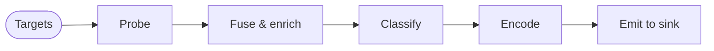

# Discover

This section is the user-level reference for running a discovery scan. It covers the `rastreo discover` CLI subcommand — every flag it accepts, the two modes it supports (flag-driven and YAML [scenario](../reference/glossary.md#scenario) files), the four target forms (IP, CIDR, range, DNS), the output [sinks](../reference/glossary.md#sink) records can be written to, and the enrichment [fusers](../reference/glossary.md#fuser) that populate vendor information on the records.

Every scan runs the same pipeline. You give it targets, and one record per device comes out the end:

-   :material-console:{ .lg .middle } **CLI**

    ---

    Every flag `rastreo discover` accepts, plus YAML-driven mode with `--file`. See the [Scenario schema](../reference/scenario.md) for the file shape.

    [:octicons-arrow-right-24: CLI](cli.md)

-   :material-bookshelf:{ .lg .middle } **Catalog**

    ---

    `@name` references and the search order across `~/.config/rastreo/catalog/`, `/etc/rastreo/catalog/`, and `RASTREO_CATALOG_DIR`.

    [:octicons-arrow-right-24: Catalog](catalog.md)

-   :material-check-decagram:{ .lg .middle } **Validate**

    ---

    Lint a scenario file offline before a real scan, including secured Kafka and NATS sink configs with no broker running.

    [:octicons-arrow-right-24: Validate](validate.md)

-   :material-crosshairs:{ .lg .middle } **Targets**

    ---

    The four target forms (IP, CIDR, range, DNS) and how the CLI detects each one.

    [:octicons-arrow-right-24: Targets](targets.md)

-   :material-database-export:{ .lg .middle } **Sinks**

    ---

    stdout, file, Kafka, and NATS output, and how the destination picks the table or NDJSON.

    [:octicons-arrow-right-24: Sinks](sinks.md)

-   :material-tag-multiple:{ .lg .middle } **Enrichment**

    ---

    SNMP `sysObjectID` lookup of vendor, model, and product family, the bundled seed table, and how to override it.

    [:octicons-arrow-right-24: Enrichment](enrichment.md)

-   :material-merge:{ .lg .middle } **Identity**

    ---

    Merges records that describe the same physical device and populates `alt_ips` / `possible_alias_of`.

    [:octicons-arrow-right-24: Identity](identity.md)

-   :material-label:{ .lg .middle } **Classification**

    ---

    The pipeline stage that assigns canonical `platform`, `os_version`, and `role` values on each `DeviceRecord`.

    [:octicons-arrow-right-24: Classification](classification.md)

-   :material-graph:{ .lg .middle } **Topology**

    ---

    Turns [LLDP](../probe/lldp.md) neighbor data into `LinkRecord` edges on a second stream, and maps them to NetBox cables and Nautobot interface connections.

    [:octicons-arrow-right-24: Topology](topology.md)

-   :material-cog-transfer:{ .lg .middle } **Collection profiles**

    ---

    Emits a `CollectionProfileRecord` per gNMI endpoint that answered Capabilities, describing how a downstream collector streams telemetry from it. A separate stream, like topology.

    [:octicons-arrow-right-24: Collection profiles](collection-profile.md)

