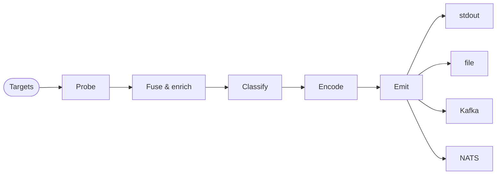

<p align="center" markdown>
  { width="300" }
  { width="300" }
</p>

<p align="center" markdown>
  [](https://crates.io/crates/rastreo)
  [](https://github.com/davidban77/rastreo/actions/workflows/ci.yml)
  [](https://github.com/davidban77/rastreo/blob/main/LICENSE-MIT)
</p>

<h1 class="rastreo-hero__tagline" markdown="span">
Point rastreo at a network. Get back a clean, structured list of every device that answers — and what each one is.
</h1>

rastreo scans a range of addresses and finds every device that answers. For each device, it works out:

- who made it (the vendor),
- what software it runs (the platform), and
- what job it does on the network (the role).

It merges everything it learns into one clean record per device — deduplicated and ready to load into your inventory.

<p align="center" markdown>
[Get started](get-started/index.md){ .md-button .md-button--primary }
[View on GitHub](https://github.com/davidban77/rastreo){ .md-button }
</p>

## Install

One line on Linux or macOS. Docker and Cargo work too.

=== "Script"

    ```bash
    curl -fsSL https://raw.githubusercontent.com/davidban77/rastreo/main/install.sh | sh
    ```

=== "Docker"

    ```bash
    docker run --rm --entrypoint /rastreo ghcr.io/davidban77/rastreo:latest discover --target 1.1.1.1
    ```

=== "Cargo"

    ```bash
    cargo install --path rastreo --features kafka,http,snmp,arp,ndp,oui,nats,ssh,icmp,tls,gnmi,lldp
    ```

    Naming the features matches what the script and the image install. Plain `cargo install --path rastreo` compiles only four probers.

See [Install](get-started/install.md) for every path, including the Helm chart for Kubernetes.

## Try it

One command, no config file, no flags beyond the target:

```bash
rastreo discover --target 1.1.1.1
```

It prints one row per device it finds, as a table sized to your terminal. The scan summary goes to stderr, so stdout carries nothing but records.

```text
ADDRESS                      NAME                      PLATFORM              PORTS
1.1.1.1                      one.one.one.one           -                     80,443,8080,8443
```

Four columns are a triage view, not the whole record. Add `--format json` for everything the scan learned, one JSON object per line and ready to pipe:

```bash
rastreo discover --target 1.1.1.1 --format json
```

=== "Output"

    ```json
    {"identity_key":"ip:1.1.1.1","mgmt_ip":"1.1.1.1","mac":null,"manufacturer":null,"platform":null,"os_version":null,"role":null,"confidence":1.0,"last_seen":"2026-07-26T23:28:06.581327Z","signals":[{"IcmpEchoRttMicros":16128},{"OpenPort":80},{"OpenPort":443},{"OpenPort":8080},{"HttpBanner":"cloudflare"},{"OpenPort":8443},{"TlsProtocolVersion":"TLSv1.3"},{"TlsCipherSuite":"TLS_AES_256_GCM_SHA384"},{"TlsAlpn":"h2"},{"TlsSubject":"cloudflare-dns.com"},{"TlsSanName":"cloudflare-dns.com"},{"TlsSanName":"*.cloudflare-dns.com"},{"TlsSanName":"ip:1.0.0.1"},{"TlsSanName":"ip:1.1.1.1"},{"TlsSanName":"ip:162.159.36.1"},{"TlsSanName":"ip:162.159.46.1"},{"TlsSanName":"ip:2606:4700:4700::1001"},{"TlsSanName":"ip:2606:4700:4700::1111"},{"TlsSanName":"ip:2606:4700:4700::64"},{"TlsSanName":"ip:2606:4700:4700::6400"},{"TlsSanName":"one.one.one.one"},{"ReverseDnsName":"one.one.one.one"}],"probe_kinds":["Icmp","TcpConnect","Http","Tls","ReverseDns"],"schema_version":"v1","schema_id":"https://davidban77.github.io/rastreo/schemas/device-record-v1.json","possible_alias_of":null,"scan_metadata":{"scan_id":"01KYGC3NE0253PQ008C94HFW13","scenario_name":null,"initiated_at":"2026-07-26T23:28:05.568266Z","source_config_hash":"sha256:4e688bf2179b5b97b79369e4fc15e69289b74371da9d84f0dd792b7d137393ba"}}
    ```

=== "The same record through `jq .`"

    ```json
    {
      "identity_key": "ip:1.1.1.1",
      "mgmt_ip": "1.1.1.1",
      "mac": null,
      "manufacturer": null,
      "platform": null,
      "os_version": null,
      "role": null,
      "confidence": 1.0,
      "last_seen": "2026-07-26T23:28:06.581327Z",
      "signals": [
        { "IcmpEchoRttMicros": 16128 },
        { "OpenPort": 80 },
        { "OpenPort": 443 },
        { "OpenPort": 8080 },
        { "HttpBanner": "cloudflare" },
        { "OpenPort": 8443 },
        { "TlsProtocolVersion": "TLSv1.3" },
        { "TlsCipherSuite": "TLS_AES_256_GCM_SHA384" },
        { "TlsAlpn": "h2" },
        { "TlsSubject": "cloudflare-dns.com" },
        { "TlsSanName": "cloudflare-dns.com" },
        { "TlsSanName": "*.cloudflare-dns.com" },
        { "TlsSanName": "ip:1.0.0.1" },
        { "TlsSanName": "ip:1.1.1.1" },
        { "TlsSanName": "ip:162.159.36.1" },
        { "TlsSanName": "ip:162.159.46.1" },
        { "TlsSanName": "ip:2606:4700:4700::1001" },
        { "TlsSanName": "ip:2606:4700:4700::1111" },
        { "TlsSanName": "ip:2606:4700:4700::64" },
        { "TlsSanName": "ip:2606:4700:4700::6400" },
        { "TlsSanName": "one.one.one.one" },
        { "ReverseDnsName": "one.one.one.one" }
      ],
      "probe_kinds": [ "Icmp", "TcpConnect", "Http", "Tls", "ReverseDns" ],
      "schema_version": "v1",
      "schema_id": "https://davidban77.github.io/rastreo/schemas/device-record-v1.json",
      "possible_alias_of": null,
      "scan_metadata": {
        "scan_id": "01KYGC3NE0253PQ008C94HFW13",
        "scenario_name": null,
        "initiated_at": "2026-07-26T23:28:05.568266Z",
        "source_config_hash": "sha256:4e688bf2179b5b97b79369e4fc15e69289b74371da9d84f0dd792b7d137393ba"
      }
    }
    ```

`--format json` also drops the banners, so stdout carries records and nothing else. Without it, the banners on stderr confirm what ran:

```text
▶ discover  targets: 1 | probes: icmp (count 3, interval_ms 200), tcp_connect (ports 22, 23, 80, 443, 830, 8080), http (ports 80, 443, 8080, 8443), ssh (ports 22), tls (ports 443), snmp (ports 161, V2c), reverse_dns (system resolvers) | concurrency: 64 | timeout: 1000ms | sink: stdout
■ discover  completed in 1.0s | hosts: 1 | records: 1 | probes: 7 | faults: 0 | sink: stdout
```

!!! info "Why some fields are empty"
    With no `--probe` flag, rastreo runs its default probe set — seven probers on a release binary. `mac` needs a target on the local segment, `manufacturer` needs that MAC, and `platform` and `role` need banners that match a classification rule. Point the same command at a switch or a router and they fill in. See [Probe](probe/index.md) and [Enrichment](discover/enrichment.md).

## What you can do with it

<div class="grid cards" markdown>

-   :material-lan:{ .lg .middle } **Sweep a whole subnet**

    ---

    Give rastreo a range like `10.0.0.0/24`. It probes every address in parallel and returns one record per live host.

    [:octicons-arrow-right-24: Targets](discover/targets.md)

-   :material-fingerprint:{ .lg .middle } **Identify every device**

    ---

    Thirteen built-in probers read HTTP banners, SNMP, SSH host keys, TLS certificates, and more, then merge the answers into one record.

    [:octicons-arrow-right-24: Probe](probe/index.md)

-   :material-sync:{ .lg .middle } **Feed your inventory**

    ---

    Emit each record to a Kafka or NATS topic. Downstream consumers sync it into NetBox, Nautobot, or Infrahub on their own schedule.

    [:octicons-arrow-right-24: Integrate](integrate/index.md)

-   :material-package-variant-closed:{ .lg .middle } **Run it anywhere**

    ---

    One static binary, a Docker image, or a Helm chart. Pick whatever fits your setup, with no extra dependencies to install.

    [:octicons-arrow-right-24: Deploy](deploy/index.md)

</div>

## How it works

Every scan runs the same short pipeline. You give it targets, and one record per device comes out the other end.



In plain words: it resolves your targets, probes each one, merges the answers, classifies the device, then emits the record.

New here? Start with [Get started](get-started/index.md), or read the [Probe reference](probe/index.md) to see every prober and the signals it reads.
